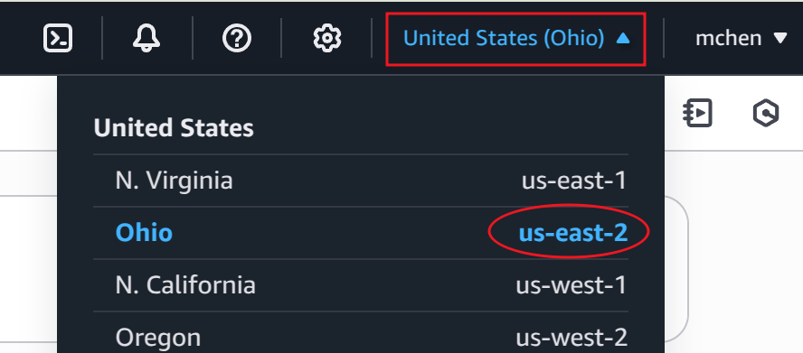
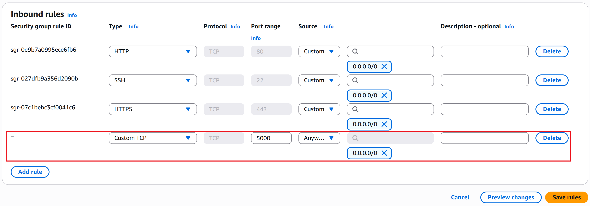
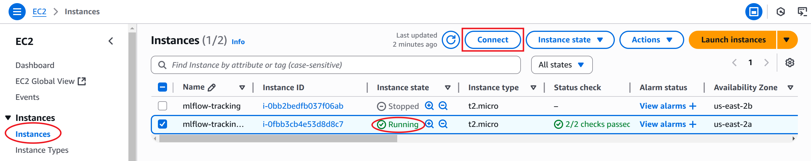
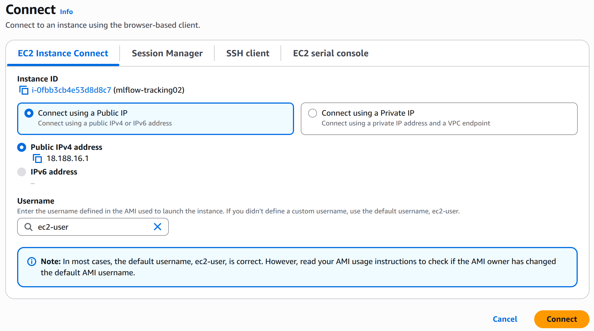

Project: Remote Deployment of MLflow on AWS
===========================================
This project is demonstrate how to deploy MLflow tracking on AWS cloud. The ML process involves using ElasticNet to predict the wine quality.

IAM, S3, EC2, AWSCLI setup
==========================
1.  Create IAM user
       
    1.1. Create IAM
    • Access IAM (if first time, search for IAM, click User) -->  Create User 
    • input User Name, click Next
    • select “Attach Policies directly” >>  select AdministratorAccess >> click Next
    • click Create User

    1.2. Access Key
    • click the New User to Access >> click Security credential >> Under Access keys, click Create access key, select confirmation
    • Select Command Line Interface (CLI) >> click Next
    • Click Create access key
    • download .csv file >> click Done
       
2.  AWS CLI setup in Terminal

    2.1. install AWS CLI

    2.2. Export the credentials in your AWS CLI
    • run “aws configure”
      “AWS Access Key ID” and “AWS Secret Access Key” are from section 1.2. Access Key” 
      “Default region name” and  “Default output format” can use the default value, just press Enter.

3.  Create a s3 bucket
    • Access S3 (if first time, search for S3, click) 
    • On top right, check if the region name aligns with section 2.2. setup AWS CLI >> click Create Bucket
        

    • Under Buket Type, select General purpose >> Under Bucket name, type in the name >> Under Block Public Access…, uncheck Block all public access and check the acknowledge of warning >> click Create bucket.

4.  Create EC2 virtual machine
       
    4.1. Create EC2 machine (Ubuntu)
    • Access EC2 (if first time, search for EC2, click) >> click Launch instance
    • Under Name, type in name >> Under Quick Start, select Ubuntu >> Under Amazon Machine (AMI), select one option from dropdown >> under Key pair (login), create new key pair >> Under Network Settings / Firewall (security groups), check all options >> click Launch instance

    4.2. add Security groups 5000 port
    • click the new EC2 instance
    • click Security >> click Security groups
    • Under Inbound rules tab, click Edit inbound rules
    • click Add rule >> Type=Custom TCP, Port Range=5000, Source=0.0.0.0/0 >> click Save rules
        

5.  connect to EC2 machine
    • go to EC2 instances
    • select the instance to be connected (has to be running) >> click Connect (on top right)
        
    
    • click Connect
        


6.  install libraries & run commands on EC2 machine
    ```bash
    sudo apt update
    sudo apt install python3-pip
    sudo apt install pipenv
    sudo apt install virtualenv
    mkdir mlflow
    cd mlflow
    pipenv install mlflow
    pipenv install awscli
    pipenv install boto3
    pipenv shell

    # Then set aws credentials as section 2.2
    aws configure

    # setup remote server EC2
    mlflow server \
        --backend-store-uri sqlite:///mlflow.db \         # save run metadata on EC2 backend-store
        --default-artifact-root s3://mlflowtracking1 \    # save artifacts on s3 bucket
        --host 0.0.0.0 \
        --port 5000
    ```